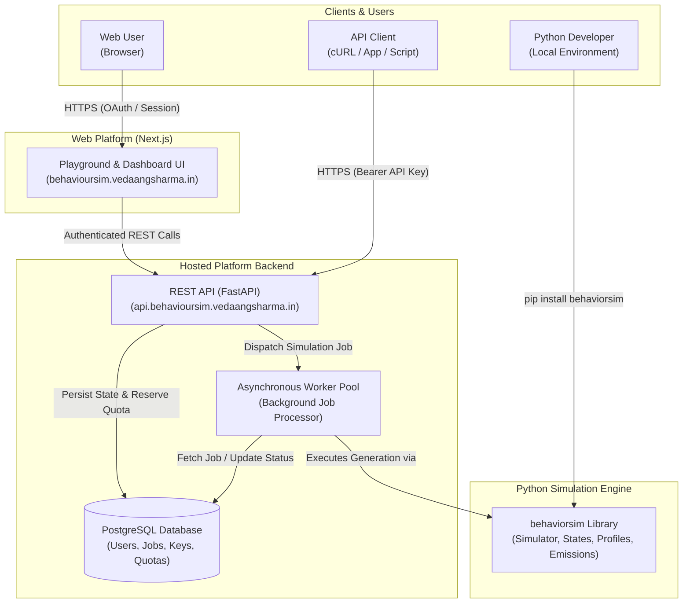

# BehaviourSim: Synthetic Sequential Behavioral Data Generation Platform

[](https://pypi.org/project/behaviorsim/)
[](https://www.python.org/)
[](https://docs.pytest.org/)
[](LICENSE)
[](#reproducibility)
[](https://behavioursim.vedaangsharma.in)
[](https://api.behavioursim.vedaangsharma.in/health)

**BehaviourSim** is a platform for generating, calibrating, feature-engineering, and analyzing synthetic sequential behavioral telemetry with ground-truth discrete states.

The project is structured as an integrated ecosystem:

```text
BehaviourSim
├── Python Simulation Engine   (behaviorsim — local scientific library & CLI)
├── Hosted REST API            (FastAPI — authenticated asynchronous execution)
└── Web Platform               (Next.js — interactive playground & dashboard)
```

The **Python package** can be installed and executed locally for programmatic control and scientific research, while the **hosted REST API** and **Web platform** allow developers, analysts, and domain experts to configure, run, and inspect simulations without installing local dependencies.

---

## Public BehaviourSim

| Resource | URL | Description |
| :--- | :--- | :--- |
| 🌐 **Web Platform** | [behavioursim.vedaangsharma.in](https://behavioursim.vedaangsharma.in/) | Interactive browser-based simulation playground, preset explorer, and usage dashboard |
| 🔌 **Production API** | [api.behavioursim.vedaangsharma.in](https://api.behavioursim.vedaangsharma.in/) | Hosted REST API for remote simulation submission, quota management, and data retrieval |
| 📦 **PyPI Package** | [pypi.org/project/behaviorsim/](https://pypi.org/project/behaviorsim/) | Published Python distribution (`pip install behaviorsim`) |
| 💻 **Core Repository** | [github.com/gtathelegend/BehaviourSim](https://github.com/gtathelegend/BehaviourSim) | Python simulation engine, calibration routines, causal features, CLI, and test suite |
| ⚙️ **API Repository** | [github.com/gtathelegend/BehaviourSim-API](https://github.com/gtathelegend/BehaviourSim-API) | FastAPI application, worker orchestration, PostgreSQL persistence, and quota management |
| 🎨 **Web Repository** | [github.com/gtathelegend/BehaviourSim-Web](https://github.com/gtathelegend/BehaviourSim-Web) | Next.js/React frontend application, interactive playground, and account management UI |

---

## BehaviourSim Ecosystem

BehaviourSim provides three distinct interfaces to suit different workflows:

### 🐍 Python Library (`behaviorsim`)
The core `behaviorsim` package provides the underlying synthetic sequential behavioral simulation engine.
- **Use it when you want**: Local execution, full programmatic control, custom state transition topologies, empirical calibration against observed data, causal feature pipelines, or integration into Python/PyData workflows.
- **Repository**: [github.com/gtathelegend/BehaviourSim](https://github.com/gtathelegend/BehaviourSim)
- **PyPI**: [pypi.org/project/behaviorsim/](https://pypi.org/project/behaviorsim/)

### 🔌 REST API
The hosted REST API exposes BehaviourSim over HTTP for remote execution and service integration.
- **Capabilities**: Authenticated access, asynchronous simulation submission, durable background execution, real-time job status tracking, simulation history, result retrieval, quota reservation, per-minute rate limiting, and system diagnostics.
- **Use it when you want**: To invoke simulations from non-Python applications, run remote workloads without managing compute environments, or automate telemetry generation in CI/CD and data services.
- **Base URL**: `https://api.behavioursim.vedaangsharma.in`
- **Repository**: [github.com/gtathelegend/BehaviourSim-API](https://github.com/gtathelegend/BehaviourSim-API)

### 🌐 Web Platform
The hosted Web platform provides an intuitive, browser-based user interface for BehaviourSim.
- **Capabilities**: Interactive playground, domain preset selection, graphical parameter configuration (interactions, random seed, behavioral profiles), OAuth-based authentication, account and usage dashboards, telemetry inspection, and API key generation.
- **Use it when you want**: Rapid scenario exploration, visual telemetry analysis, demonstration, or evaluation without writing code or making direct API calls.
- **Production URL**: [https://behavioursim.vedaangsharma.in](https://behavioursim.vedaangsharma.in/)
- **Repository**: [github.com/gtathelegend/BehaviourSim-Web](https://github.com/gtathelegend/BehaviourSim-Web)

---

## Architecture Overview

The following diagram illustrates how the components of the BehaviourSim ecosystem interact:



> [!NOTE]
> The Python Core library (`behaviorsim`) is the underlying simulation engine used by both local Python scripts and the hosted worker pool. Web browsers communicate exclusively with the application layer; the browser never accesses the worker pool or database directly.

---

## Choosing an Interface

| Feature / Aspect | Python Package (`behaviorsim`) | Hosted REST API | Hosted Web Platform |
| :--- | :--- | :--- | :--- |
| **Primary Audience** | Data scientists, ML researchers, Python engineers | Backend services, automation scripts, multi-language tools | Product managers, analysts, rapid experimenters |
| **Execution Model** | Local, synchronous or in-process execution | Hosted, asynchronous worker queue | Hosted, asynchronous cloud execution |
| **Interface** | Python API & CLI (`behaviorsim`) | REST HTTP endpoints (`JSON`) | Web browser graphical interface |
| **Installation** | `pip install behaviorsim` | None (HTTP client like `curl` or `requests`) | None (Web browser) |
| **Custom Topologies** | Full custom Markov matrices, profiles, distributions | Standard presets with profile and seed customization | Standard presets with visual parameter controls |
| **Authentication** | None (runs locally) | API Key (`Bearer <API_KEY>`) | OAuth (GitHub / Google) & secure browser sessions |
| **Best For** | Heavy batch simulations, custom research pipelines | Service integrations, CI/CD, headless automation | Quick scenario inspection, visual trace exploration |

---

## Using the Python Library

### Installation

#### Standard Installation
```bash
pip install behaviorsim
```

#### With Optional Dependencies
```bash
# Columnar Parquet export support (pyarrow)
pip install "behaviorsim[parquet]"

# Publication-grade visualization (matplotlib, seaborn)
pip install "behaviorsim[viz]"

# Empirical calibration & clustering (scikit-learn)
pip install "behaviorsim[calibration]"

# Complete feature set
pip install "behaviorsim[all]"
```

#### Development Installation
```bash
git clone https://github.com/gtathelegend/BehaviourSim.git
cd BehaviourSim
pip install -e ".[dev]"
```

**Requirements**: Python `>=3.9`, NumPy `>=1.24`, Pandas `>=2.0`, SciPy `>=1.10`, PyYAML `>=6.0`.

---

### Python Quick Start

Generate synthetic behavioral data in a few lines of Python:

```python
import numpy as np
from behaviorsim import Simulator, State, Profile, FeatureDistribution

# 1. Define discrete behavioral states
states = [State("Browse"), State("Cart"), State("Checkout")]

# 2. Configure state-conditioned feature emissions
emissions = {
    "Browse": {"dwell_sec": FeatureDistribution("exponential", {"scale": 15.0})},
    "Cart": {"dwell_sec": FeatureDistribution("normal", {"mean": 45.0, "std": 10.0})},
    "Checkout": {"dwell_sec": FeatureDistribution("normal", {"mean": 90.0, "std": 15.0})},
}

# 3. Define the state transition matrix P(s_{t+1} | s_t)
transitions = np.array([
    [0.70, 0.25, 0.05],
    [0.20, 0.60, 0.20],
    [0.00, 0.00, 1.00],
])

# 4. Construct Profile and Simulator
profile = Profile("Shopper", state_emissions=emissions, transition_matrix=transitions)
sim = Simulator(states=states, profile=profile, initial_state="Browse")

# 5. Generate reproducible interaction traces
df = sim.generate(num_interactions=10, num_sequences=5, seed=42)
print(df[["sequence_id", "interaction_id", "state", "dwell_sec"]].head())
```

#### Using Domain Presets in Python
You can also instantiate simulators directly from built-in presets:

```python
from behaviorsim import Simulator

# Instantiate a simulator using the built-in education preset
sim = Simulator.from_preset("education", profile="fast_accurate")
df = sim.generate(num_interactions=20, num_sequences=3, seed=101)
print(df.head())
```

---

## Using the Hosted API

The hosted BehaviourSim API allows applications and services to run simulations remotely without local dependencies.

- **Production Base URL**: `https://api.behavioursim.vedaangsharma.in`
- **Protocol**: HTTPS (TLS 1.3/1.2 enforced)
- **API Status**: [https://api.behavioursim.vedaangsharma.in/health](https://api.behavioursim.vedaangsharma.in/health)

> [!NOTE]
> Interactive OpenAPI / Swagger documentation (`/docs`) is intentionally disabled in the production environment. Refer to the verified route definitions below.

### Authentication

The API supports two authentication mechanisms:
1. **API Key Authentication**: For programmatic access, CLI scripts, and automated systems. Pass the key in the HTTP `Authorization` header:
   ```text
   Authorization: Bearer <YOUR_API_KEY>
   ```
   > [!IMPORTANT]
   > Treat API keys as sensitive credentials. Store them in secure environment variables (e.g., `export BEHAVIOURSIM_API_KEY="your-api-key"`). Never commit API keys to version control.
2. **Browser Session Authentication**: When accessing through the Web platform, authentication is managed via secure, HttpOnly session cookies authenticated through OAuth providers.

### Asynchronous Simulation Lifecycle

Simulation workloads are processed asynchronously to prevent HTTP timeouts on multi-step traces:

```text
POST /v1/simulations
       │
       ▼  202 Accepted (returns simulation_id & status="pending")
       │
       ▼
GET /v1/simulations/{simulation_id}
       │
       ├── status: "pending"   (queued in worker pool)
       ├── status: "running"   (actively generating synthetic traces)
       └── status: "completed" (traces ready; includes interaction dataset)
```

Submitting a simulation does **not** block waiting for full generation; the initial response returns an ID that can be polled or retrieved when processing finishes.

### Verified API Endpoints

The following public endpoints are active on the production API:

| Method | Endpoint | Description | Auth Required |
| :--- | :--- | :--- | :---: |
| `GET` | `/health` | Basic service health check (`{"status":"ok","version":"0.1.0"}`) | No |
| `GET` | `/ready` | Service readiness check including database connectivity | No |
| `GET` | `/v1/presets` | List all available simulation presets, descriptions, and profiles | No |
| `GET` | `/v1/presets/{preset}` | Retrieve detailed schema and profile list for a specific preset | No |
| `GET` | `/v1/account` | Retrieve the authenticated user's account details and plan tier | Yes |
| `GET` | `/v1/usage` | Retrieve current monthly request and interaction usage statistics | Yes |
| `GET` | `/v1/api-keys` | List active API keys associated with the account | Yes |
| `POST` | `/v1/api-keys` | Generate a new API key (displayed once upon creation) | Yes |
| `DELETE` | `/v1/api-keys/{key_id}` | Revoke an API key | Yes |
| `POST` | `/v1/simulations` | Submit a simulation job for asynchronous execution (Returns `202`) | Yes |
| `GET` | `/v1/simulations` | List recent simulation runs and their current statuses | Yes |
| `GET` | `/v1/simulations/{id}` | Retrieve status and generated trace results for a simulation | Yes |
| `DELETE` | `/v1/simulations/{id}` | Delete a simulation record and its generated traces | Yes |
| `GET` | `/v1/diagnostics` | System diagnostic metrics and worker pool health | Yes |

### API Quick Start (cURL)

#### 1. Check Service Health
```bash
curl -s https://api.behavioursim.vedaangsharma.in/health
# {"status":"ok","version":"0.1.0"}
```

#### 2. Submit a Simulation
Submit an asynchronous simulation job using the `education` preset:

```bash
curl -X POST "https://api.behavioursim.vedaangsharma.in/v1/simulations" \
  -H "Authorization: Bearer $BEHAVIOURSIM_API_KEY" \
  -H "Content-Type: application/json" \
  -d '{
    "preset": "education",
    "num_interactions": 100,
    "seed": 42
  }'
```

**Response (`202 Accepted`)**:
```json
{
  "simulation_id": "sim_01j7abc123def456",
  "status": "pending",
  "preset": "education",
  "num_interactions": 100,
  "created_at": "2026-09-15T17:30:00Z"
}
```

#### 3. Retrieve Simulation Status & Results
Poll the simulation status using the returned ID:

```bash
curl -s \
  -H "Authorization: Bearer $BEHAVIOURSIM_API_KEY" \
  "https://api.behavioursim.vedaangsharma.in/v1/simulations/sim_01j7abc123def456"
```

Once `status` reaches `"completed"`, the response contains the full simulation metadata, execution summary, and generated interaction telemetry records.

### API Free-Plan Usage Limits

The hosted API implements per-account quotas and rate limits:

| Metric | Free Plan Allowance | Notes |
| :--- | :--- | :--- |
| **Monthly Requests** | 100 requests / month | Tracked per calendar period; resets monthly |
| **Monthly Interactions** | 10,000 interactions / month | Cumulative sum of generated telemetry rows |
| **Per-Request Limit** | Max 1,000 interactions | Maximum interactions in a single simulation run |
| **Rate Limit** | 5 requests / minute | Token-bucket rate limiter |
| **Concurrency** | 1 concurrent simulation | Subsequent submissions queue or return 429 |
| **API Keys** | 1 active key | Additional keys require revoking the existing key |

*Note: You can inspect your active consumption at any time via `GET /v1/usage` or through the Web account dashboard.*

### API Error Handling

The API returns structured error responses with descriptive messages and tracing identifiers:

```json
{
  "error": {
    "message": "Missing authentication credentials.",
    "status_code": 401,
    "details": {},
    "request_id": "ba47e6a5-76ee-4e39-9fd6-e72413d43247"
  }
}
```

- **HTTP Status Codes**: `200` (Success), `201` (Created), `202` (Accepted/Queued), `400` (Bad Request / Validation Error), `401` (Unauthorized), `403` (Forbidden / Quota Exceeded), `404` (Not Found), `429` (Rate Limited), `500` (Internal Server Error).
- **Request Tracing**: All responses include an `X-Request-ID` HTTP header corresponding to the `request_id` field in error payloads.

---

## Using the Web Platform

The BehaviourSim Web platform provides an interactive visual interface hosted at [behavioursim.vedaangsharma.in](https://behavioursim.vedaangsharma.in/).

### Typical User Workflow
1. **Visit the Site**: Navigate to [behavioursim.vedaangsharma.in](https://behavioursim.vedaangsharma.in/).
2. **Sign In**: Authenticate using your GitHub or Google account.
3. **Open the Playground**: Navigate to the simulation playground from the top navigation.
4. **Select a Domain Preset**: Choose between `education`, `mobile_app`, `healthcare`, or `finance`.
5. **Configure Parameters**: Adjust interaction count, random seed, and archetype profiles via interactive sliders and dropdowns.
6. **Execute**: Submit the simulation for asynchronous background processing.
7. **Monitor Progress**: Watch the job transition from queued to running to completed.
8. **Inspect Telemetry**: Explore the generated discrete state transitions and continuous feature emissions through the interactive data table.
9. **Account Dashboard**: Review monthly request/interaction quota usage and manage your API keys.

---

## Presets

BehaviourSim includes four production presets representing diverse sequential behavioral dynamics:

| Preset | Ground-Truth States | Emitted Features | Default Profile | Available Profiles |
| :--- | :--- | :--- | :--- | :--- |
| **`education`** | `Optimal`, `Overload`, `Underload` | `accuracy`, `difficulty`, `nrt`, `retries`, `help_requested`, `confidence` | `average` | `average`, `fast_accurate`, `fast_inaccurate`, `slow_accurate`, `slow_inaccurate` |
| **`mobile_app`**| `Browsing`, `ActiveSession`, `CheckoutFlow`, `Idle`, `Churned` | `session_time_seconds`, `action_count`, `scroll_depth`, `button_clicks`, `cart_value` | `casual_browser` | `casual_browser`, `power_user`, `deal_seeker`, `infrequent_visitor` |
| **`healthcare`**| `Baseline`, `Elevated`, `Critical`, `Recovery`, `Discharged` | `heart_rate_bpm`, `systolic_bp`, `spo2_pct`, `temperature_c`, `alert_triggered`, `mobility_score` | `stable_patient` | `stable_patient`, `chronic_risk`, `post_operative`, `geriatric_frail` |
| **`finance`**   | `Stable`, `Active`, `Volatile`, `Drawdown`, `Recovered`, `Closed` | `portfolio_value`, `daily_return`, `transaction_count`, `trade_volume`, `volatility`, `drawdown`, `risk_alert` | `balanced_investor` | `conservative_investor`, `balanced_investor`, `growth_investor`, `active_trader` |

> [!WARNING]
> **Domain Disclaimers**:
> - **Healthcare**: The healthcare preset is a synthetic benchmark model for evaluating telemetry processing algorithms. It is **NOT** a clinically validated medical model and must **NOT** be used for patient diagnosis, clinical triaging, or healthcare decisions.
> - **Finance**: The finance preset is a synthetic statistical simulation. It is **NOT** financial, investment, trading, or fraud-detection advice.

---

## Production Platform Capabilities

The hosted BehaviourSim platform is backed by production-grade infrastructure:

- **PostgreSQL Persistence**: ACID-compliant relational storage for user accounts, API keys, quota allocations, and simulation execution histories.
- **Durable Asynchronous Job Processing**: Decoupled worker processes that consume from a persistent queue, guaranteeing execution even under concurrent load.
- **Atomic Quota Reservation**: Two-phase quota reservation prevents race conditions and ensures users stay within their allotted monthly allowances.
- **Sliding-Window Rate Limiting**: Token-bucket rate limiting protects endpoints against denial-of-service and bursts.
- **Simulation History & Hard Deletion**: Users maintain control over their data with explicit simulation history listings and permanent deletion endpoints (`DELETE /v1/simulations/{id}`).
- **Health & Readiness Probes**: Dedicated `/health`, `/ready`, and `/v1/diagnostics` endpoints facilitate continuous uptime monitoring and database connectivity verification.
- **Automated Data Retention**: Configurable lifecycle policies ensure expired simulation payloads are cleaned up systematically.

---

## Security

The platform adheres to strict modern application security practices:

- **Transport Security**: Enforced HTTPS across all web and API endpoints with HTTP Strict Transport Security (`HSTS`).
- **Session Protection**: Web sessions use secure, `HttpOnly`, `SameSite=Lax` cookies with strict OAuth state validation to prevent CSRF attacks.
- **Hashed API Keys**: API keys are hashed (SHA-256) at rest; plain-text keys are displayed exactly once at creation and cannot be retrieved from the database.
- **Hardened HTTP Headers**: Strict Content Security Policy (`CSP`), `X-Frame-Options: DENY`, `X-Content-Type-Options: nosniff`, and restricted `Referrer-Policy`.
- **CORS Restriction**: API CORS headers are restricted to authorized origins rather than wildcard permissions.
- **Strict Input Validation**: All inbound payloads are validated using Pydantic models with bounded ranges (e.g., maximum interaction limits).
- **Sandboxed Execution**: The public API does not accept or execute arbitrary Python code; all remote executions strictly instantiate pre-compiled, schema-validated presets.

---

## Calibration

BehaviorSim provides an empirical calibration subsystem that fits parameters from observed interaction logs without heuristic guessing:

```python
from behaviorsim.calibration import CalibrationData, fit_profile, validate_calibration

# 1. Package observed traces
cal_data = CalibrationData(
    data=observed_df,
    states=["Browse", "Cart", "Checkout"],
    numeric_features=["dwell_sec"],
)

# 2. Fit generative Profile
calibrated_profile = fit_profile(cal_data, name="FittedShopper", transition_smoothing=0.01)

# 3. Simulate synthetic counterparts
sim = Simulator(states=[State(s) for s in cal_data.states], profile=calibrated_profile)
synthetic_df = sim.generate(num_interactions=10, num_sequences=50, seed=123)

# 4. Statistically validate fidelity
report = validate_calibration(
    empirical_data=cal_data,
    synthetic_data=synthetic_df,
    profile=calibrated_profile,
    thresholds={"max_state_tvd": 0.15, "max_transition_mae": 0.10},
)
print(f"Validation Passed: {report.is_valid}")
```

### Conceptual Boundary on Latent Identifiability
BehaviorSim uses **explicit proxy-based state extraction** (`extract_state_proxy`) or user-declared state columns. It deliberately avoids unsupervised HMM/Baum-Welch latent-state discovery, which is mathematically non-identifiable without strong structural assumptions.

---

## Feature Engineering

The feature engineering layer computes historical sequential metrics under a **strict causal contract**:

$$
\text{feature}_t = f(x_0, x_1, \dots, x_{t-1})
$$

Features computed at interaction $t$ evaluate observations strictly prior to step $t$. Current step outcomes and future steps are never leaked.

```python
from behaviorsim.feature_engineering import build_behavioral_features

enriched_df = build_behavioral_features(
    df,
    numeric_columns=["dwell_sec"],
    rolling_windows=[3, 5],
    rolling_stats=["mean", "var"],
    sequence_column="sequence_id",
)
```

---

## Visualization

BehaviorSim includes a publication-grade visualization layer returning standard matplotlib `(fig, ax)` tuples:

```python
from behaviorsim.visualization import (
    plot_state_occupancy,
    plot_state_trajectory,
    plot_transition_matrix,
    plot_calibration_summary,
    save_figure,
)

# State occupancy proportions
fig, ax = plot_state_occupancy(df, state_column="state")
save_figure(fig, "figures/occupancy.png", close=True)

# Discrete state trajectories
fig, ax = plot_state_trajectory(df, max_sequences=5)
save_figure(fig, "figures/trajectories.png", close=True)

# Transition heatmap
fig, ax = plot_transition_matrix(df)
save_figure(fig, "figures/transitions.png", close=True)

# Calibration diagnostic dashboard
fig, axes = plot_calibration_summary(report)
save_figure(fig, "figures/calibration_dashboard.png", close=True)
```

---

## Declarative Configuration & CLI

Simulations can be completely defined in declarative YAML or JSON files:

```yaml
version: "1.0"
states: ["Exploration", "Checkout"]
initial_state: "Exploration"
profiles:
  default:
    probability: 1.0
    transitions:
      matrix: [[0.8, 0.2], [0.0, 1.0]]
    emissions:
      Exploration:
        dwell: { distribution: "normal", params: { mean: 30.0, std: 5.0 } }
      Checkout:
        dwell: { distribution: "normal", params: { mean: 60.0, std: 10.0 } }
simulation:
  n_sequences: 20
  max_steps: 15
  seed: 42
```

### CLI Commands
```bash
# Validate configuration schema
behaviorsim validate simulation.yaml

# Run simulation to CSV, JSON, or Parquet
behaviorsim run simulation.yaml -o results/traces.csv
behaviorsim run simulation.yaml -o results/traces.parquet --sequences 100 --seed 123
```

---

## Core Library Architecture

```text
src/behaviorsim/
├── core/                   # Mathematical simulation kernel
│   ├── state.py            # Discrete State representation
│   ├── feature.py          # Parametric emission FeatureDistribution
│   ├── transition.py       # Markov transitions and conditional TransitionRule
│   ├── profile.py          # Behavioral Profile container
│   ├── simulator.py        # Master Simulator engine
│   └── utils.py            # Stochastic matrix and seed utilities
├── config.py               # Declarative schema, validation, & compilation
├── cli.py                  # Command-line interface ('behaviorsim')
├── presets/                # Domain-specific simulation presets
│   ├── registry.py         # Preset registry & factory resolution
│   ├── education.py        # Cognitive load simulation preset
│   ├── mobile_app.py       # Mobile engagement & churn preset
│   ├── healthcare.py       # Patient telemetry preset
│   └── finance.py          # Portfolio risk dynamics preset
├── calibration/            # Empirical parameter calibration & diagnostics
│   ├── fitter.py           # CalibrationData, proxy extraction, matrix/emission fitting
│   ├── clustering.py       # Sequence-level k-means profile clustering
│   └── validator.py        # ValidationReport & statistical fidelity metrics
├── feature_engineering/    # Strictly causal sequential dynamics
│   ├── causal.py           # Pipeline compiler & causal validation
│   ├── windows.py          # Non-leaking rolling window statistics
│   └── transitions.py      # Dwell times, transition counters, session tracking
└── visualization/          # Publication-ready plotting & diagnostics
    ├── plot_states.py      # State occupancy & transition matrix heatmaps
    ├── plot_trajectories.py# Discrete state & continuous feature trajectories
    ├── plot_distributions.py# Aligned histograms & categorical comparisons
    ├── plot_calibration.py # Validation diagnostics & dashboard
    └── __init__.py         # Public exports & save_figure utility
```

---

## Performance & Scalability Benchmarks

Benchmarks executed on standard commodity hardware (Intel/AMD x86_64, Windows, Python 3.12):

| Workload | Sequences | Interactions/Seq | Total Rows | Generation Time | Throughput | Peak Memory |
| :--- | :---: | :---: | :---: | :---: | :---: | :---: |
| **Small** | 1 | 100 | 100 | 0.039s | ~2,580 rows/s | 0.08 MB |
| **Medium** | 10 | 10,000 | 100,000 | 17.05s | ~5,860 rows/s | 17.51 MB |
| **Large** | 50 | 2,000 | 100,000 | 16.45s | ~6,080 rows/s | 16.13 MB |
| **High-Volume** | 1 | 100,000 | 100,000 | 16.91s | ~5,910 rows/s | 45.05 MB |

> [!NOTE]
> Numerical throughput figures represent benchmark observations under test workloads on reference hardware, not absolute operational guarantees. The hosted API imposes per-request interaction bounds (maximum 1,000 interactions per request on the Free plan) to maintain responsive worker turnaround.

---

## Reproducibility

BehaviorSim guarantees **exact cross-platform reproducibility**:
- **Deterministic Seeding**: Calling `sim.generate(..., seed=42)` produces bit-for-bit identical DataFrames across runs, architectures, and operating systems.
- **Hierarchical Sequence Seeding**: Independent sequences derive isolated seeds from the master seed via deterministic cryptographic hashing (`derive_learner_seed`).
- **Headless Execution**: Fully reproducible in headless Docker containers, CI/CD runners, and background worker queues.

---

## Testing Status

The BehaviorSim test suite includes **634 passing tests** with clean diff audits across all subsystems:

```bash
# Run complete test suite
python -m pytest -q
# 634 passed, 5 skipped
```

- **Core Simulator & Dynamics**: 236 tests
- **Domain Presets**: 112 tests
- **Calibration & Clustering**: 102 tests
- **Causal Feature Engineering**: 33 tests
- **Visualization & Diagnostics**: 48 tests
- **Legacy Evaluation Suite**: 100 tests

---

## Limitations

1. **Synthetic vs. Real Behavior**: Synthetic data generates trajectories consistent with configured distributions and transition rules. It does not automatically capture unmodeled real-world confounding or non-stationary drift.
2. **Proxy Calibration**: Calibration reflects observable proxies supplied by the user; it does not infer hidden latent intent without explicit proxy definitions.
3. **No Clinical or Financial Advice**: Healthcare and financial presets are academic benchmarks and must not be used for medical diagnosis, patient care, or financial decision-making.

---

## Repository Structure & Relationships

The BehaviourSim ecosystem is maintained across three dedicated public repositories:

```text
BehaviourSim Ecosystem
├── BehaviourSim       (Core simulation engine, calibration, causal features, CLI, & PyPI package)
├── BehaviourSim-API   (Hosted REST API, worker queue, PostgreSQL persistence, auth, & quotas)
└── BehaviourSim-Web   (Next.js web application, interactive playground, & usage dashboard)
```

- **BehaviourSim (Core)**: The canonical technical landing page and home of the mathematical simulation engine, published to PyPI as `behaviorsim`.
- **BehaviourSim-API**: Backend service wrapping the core engine in a scalable FastAPI application with worker orchestration, PostgreSQL storage, and API key management.
- **BehaviourSim-Web**: Modern Next.js frontend offering interactive playgrounds, telemetry visualization, and self-service account management.

---

## Historical Context & Citation

BehaviorSim evolved from the **CLSI-Adapt** research framework for cognitive load state identification under temporal validation.

If you use BehaviorSim in academic research or technical publications, please cite:

```bibtex
@software{behaviorsim2026,
  title = {BehaviorSim: Synthetic Sequential Behavioral Data Generation Library and Platform},
  author = {Vedaang Sharma},
  year = {2026},
  url = {https://github.com/gtathelegend/BehaviourSim}
}
```

---

## Contributing

Contributions are welcome. If you find a bug, have an idea, or would like to improve the project, feel free to open an issue or submit a pull request.

- For technical bug reports and feature requests, please use [GitHub Issues](https://github.com/gtathelegend/BehaviourSim/issues).
- For questions, feedback, or project-related inquiries that require direct contact, email [info@vedaangsharma.in](mailto:info@vedaangsharma.in).

---

## Author & Maintainer

BehaviorSim is created and maintained by **Vedaang Sharma**.

- **Email**: [info@vedaangsharma.in](mailto:info@vedaangsharma.in)
- **GitHub**: [@gtathelegend](https://github.com/gtathelegend)

---

## License

This project is licensed under the MIT License — see the [LICENSE](LICENSE) file for details.
